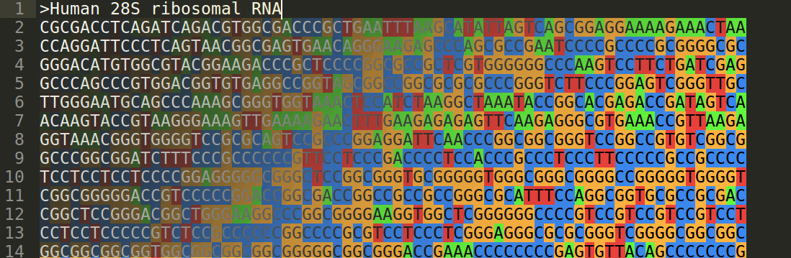
Syntax highlighting for computational biology file formats in Sublime Text 3, gtksourceview / gedit (in progress) and vim (in progress).

A hackseq 2017 (October 20 - 22) project by:
- [Artem Babaian](https://github.com/ababaian), [Eric Chu](https://github.com/echu113), [Anicet Ebou](https://github.com/ebedthan), [Alyssa Fegen](https://github.com/alyeffy), [Jeffrey Kam](https://github.com/lazypanda10117), [Gherman Novakovskiy](https://github.com/fransilvion) and [Jasper Wong](https://github.com/Jwong684)

[hackseq17 Presentation](bioSyntax_talk.pptm)

## Contents
[**Sublime Text 3**](#sublime-text-3-installation)
- [fasta](#fasta-fa-faa-fasta)
- [fastq](#fastq-fq-fastq)
- [SAM](#sam-sam)
- [Wig](#wig-wig)
- [Bed](#bed-bed)
- [PDB](#pdb-pdb)
- [GTF](#gtf-gtf)
- [VCF](#vcf-vcf)
- [Installation Instructions](#installation-instructions)

[**Gedit**](#gedit-installation)
- [fasta](#fasta-fa-fasta)
- [fastq](#fastq-fq-fastq-alpha)
- [bed](#bed-bed-alpha)
- [Installation Instructions](#installation-instructions-linux)

## Sublime Text 3 Installation

1. Download the [bioMonokai Color Scheme](theme/sublime/Color\ Scheme\ -\ bioSyntax.sublime-package).
2. Copy it to your Sublime Text application packages folder:
- **Linux**: `../sublime_text_3/Packages/`
- **Windows**: `C:/Program Files/Sublime Text 3/Packages/`
- **Mac**: `/Applications/Sublime Text.app/Contents/MacOS/Packages/`
3. Download the [bioSyntax sublime package](syntax/bioSyntax_sublime_RELEASE.zip).
4. Unzip the files into the Sublime Text Packages folder:
- **Linux**: `~/.config/sublime-text-3/Packages/User`
- **Windows**: `%APPDATA%/Roaming/Sublime Text 3/Packages/`
- **Mac**: `/Users/your_username/Library/Application Support/Sublime Text 3/Packages/`
5. Open Sublime Text and go to Preferences > Color Scheme > bioMonokai
6. Formats should auto-detect; you can select a specific syntax at the drop-menu at the bottom-right corner of the window (e.g. Plain Text)

You now have pretty formats!

## Fasta (.fa; .faa; .fasta)
A total of 6 formats available:
- [fasta.sublime-syntax](syntax/sublime/fasta.sublime-syntax): Context-dependent; able to detect if fasta file contains nucleotides or amino acids (Recommended).

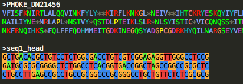

- [fasta-nt.sublime-syntax](syntax/sublime/fasta-nt.sublime-syntax): for .fa & .fasta files only, specifically for highlighting RNA bases. High-contrast colour scheme with background highlighting.

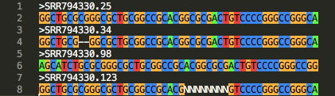

- [fasta-clustal.sublime-syntax](syntax/sublime/fasta-clustal.sublime-syntax): High-contrast amino acid highlighting.

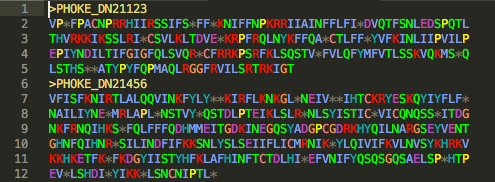

- [fasta-zappo.sublime-syntax](syntax/sublime/fasta-zappo.sublime-syntax): Residues are coloured according to their physico-chemical properties. Details can be found at [Jalview](http://www.jalview.org/version118/documentation.html#zappo).

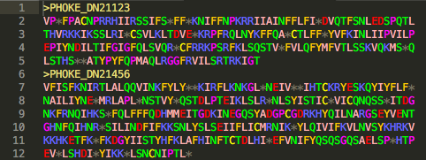

- [fasta-taylor.sublime-syntax](syntax/sublime/fasta-taylor.sublime-syntax): Details can be found on [Jalview](http://www.jalview.org/version118/documentation.html#taylor).

- [fasta-hydro.sublime-syntax](syntax/sublime/fasta-hydro.sublime-syntax): Residue highlighting according to a [hydrophobicity table](http://www.jalview.org/version118/documentation.html#hydrophobicity), ranging between red and blue, where red is the most hydrophobic residue and blue is the most hydrophilic residue.

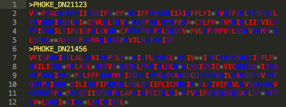

## Fastq (.fq; .fastq)
[fastq.sublime-syntax](syntax/sublime/fastq.sublime-syntax):

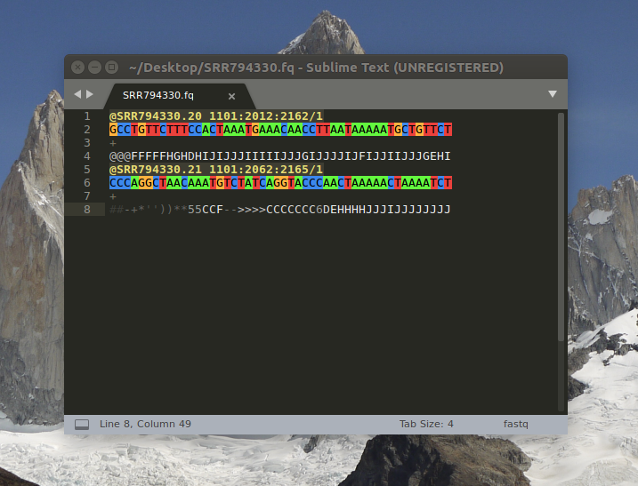

## SAM (.sam)
[sam.sublime-syntax](syntax/sublime/sam.sublime-syntax):

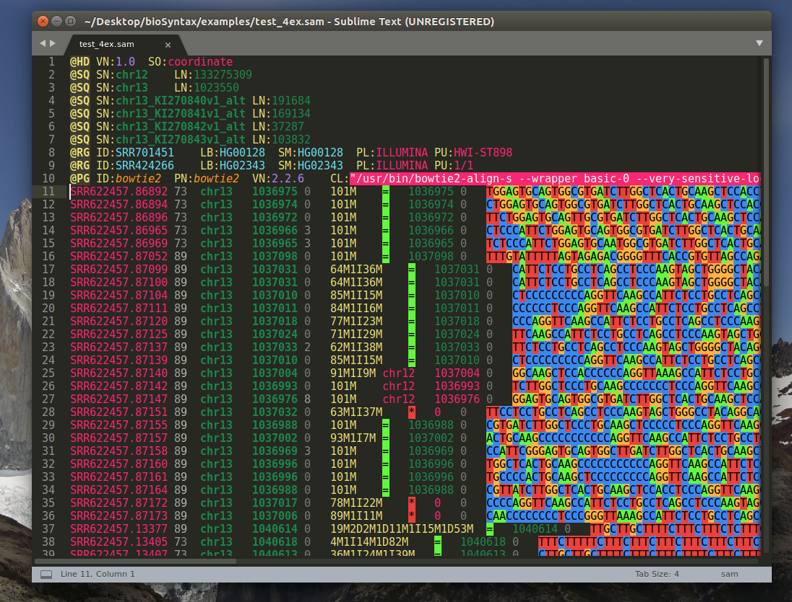

## Wig (.wig)
[wig.sublime-syntax](syntax/sublime/wig.sublime-syntax):

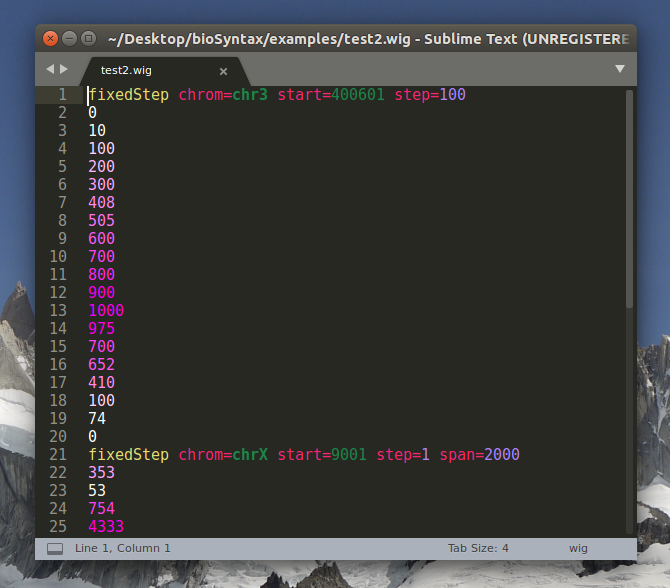

## Bed (.bed)
[bed.sublime-syntax](syntax/sublime/bed.sublime-syntax):

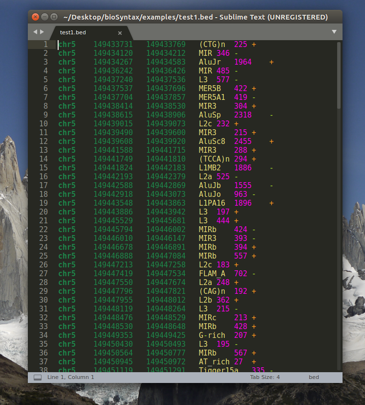

## PDB (.pdb)
[pdb.sublime-syntax](syntax/sublime/pdb.sublime-syntax):

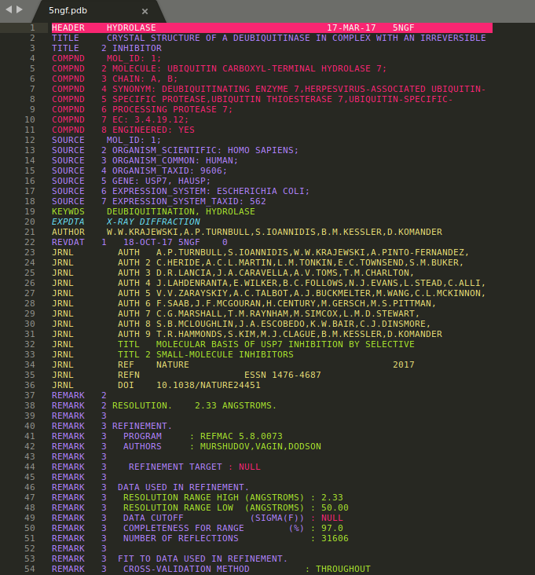

## GTF (.gtf)
[gtf.sublime-syntax](syntax/sublime/gtf.sublime-syntax)

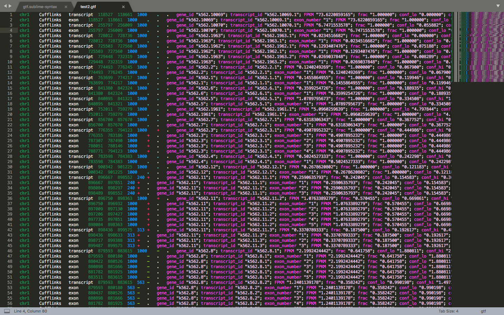

## VCF (.vcf)
[vcf.sublime-syntax](syntax/sublime/vcf.sublime-syntax):

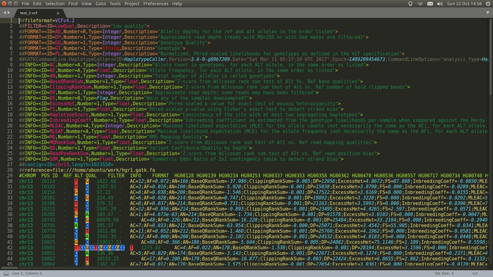

## Gedit Installation (Linux)
1. Download the respective `*.lang` files you're interested in
2. Download the `bioKate.xml` style scheme
 
3. Change permissions to all readonly
	`chmod 0644 *.lang`

4. Copy the `bioKate.xml` style scheme to gtksoureview style folder
	`sudo cp bioKate.xml /usr/share/gtksourceview-3.0/styles/bioKate.xml`

5. Copy the `*.lang` file(s) to gtksourceview language spec folder
	`sudo cp fasta.lang /usr/share/gtksourceview-3.0/language-specs/fasta.lang`

6. Restart `gedit` and you should have pretty formats 

## Fasta (.fa; .fasta)
Highlights nucleotide sequence by base. Colors match IGV representations using the Jalview palette.

## Fastq (.fq; .fastq) [alpha]
Colors headers and nucleotides. Still abit buggy but can be worked out.

## Bed (.bed) [alpha]
View bed files with colors based on columns.

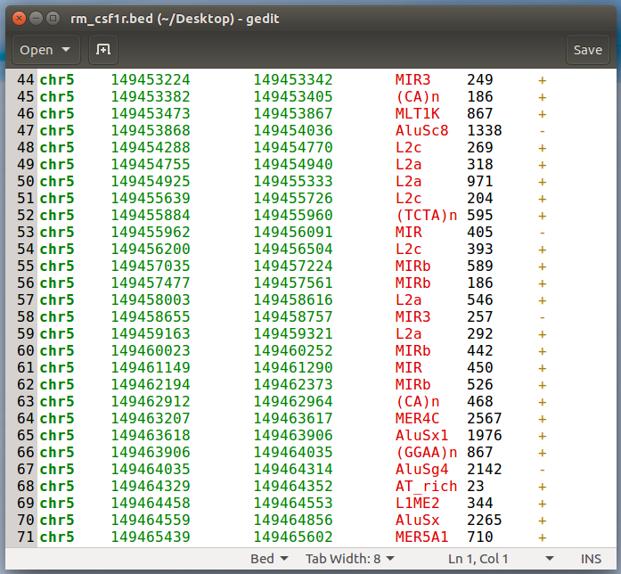

