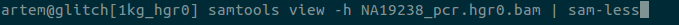

[INSTALL](install.md) \| [USING BIOSYTNAX](manual.md) \| [FILE FORMATS](formats.md) \| [COLLABORATE](collaborate.md)

Syntax highlighting for computational biology in `vim`, `less`, `sublime3` & `gedit`.

### [Watch our hackseq17 presentation (~5 min)](https://youtu.be/dHYN3E7edhY?t=6m28s)

